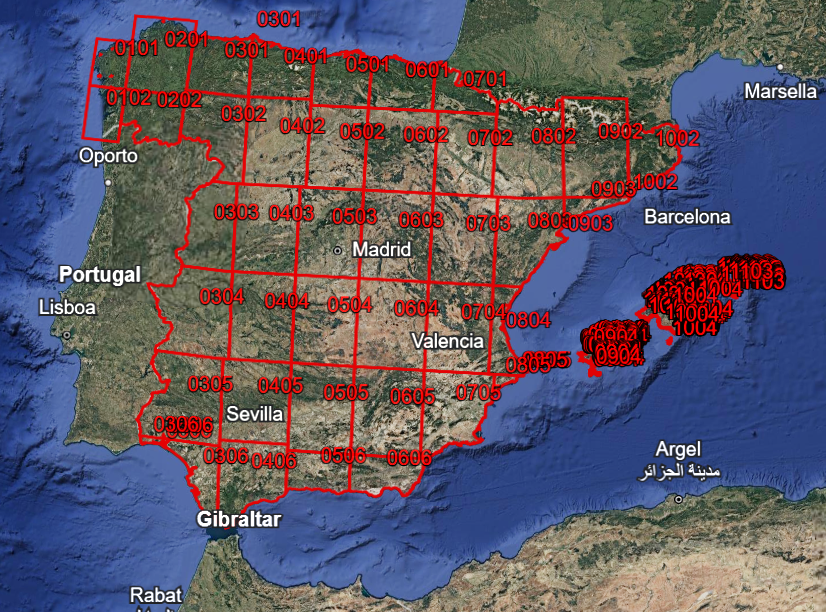
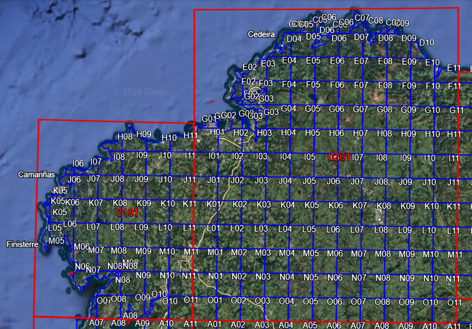

# Preprocesamiento de los Datos - Conversión de Coordenadas Militares

## Introducción
La base de datos de incendios forestales contiene registros antiguos que emplean métodos en desuso, como el sistema de hoja y cuadrícula del mapa militar 1:250.000.

Se explica aquí el proceso realizado para cruzar datos, extraer coordenadas y asignar ubicaciones aproximadas a dichos registros.

## Extracción de Coordenadas del Mapa Militar
Para localizar los registros restantes:
1. Se extrajeron las coordenadas aproximadas de las cuadrículas del mapa militar a partir de archivos `.kmz` mediante la herramienta online [MyGeodata Converter](https://mygeodata.cloud/converter).
2. Los datos se transformaron en un archivo Excel, generando una tabla que relaciona cada hoja y cuadrícula con sus coordenadas decimales --> mapa_militar.xlsx
3. Para resolver duplicados en las áreas irregulares de los bordes del mapa, se calculó la media de las coordenadas de etiquetas repetidas.
4. Se genera un excel con el mapa militar modificado --> mapa_militar_mod.xlsx
